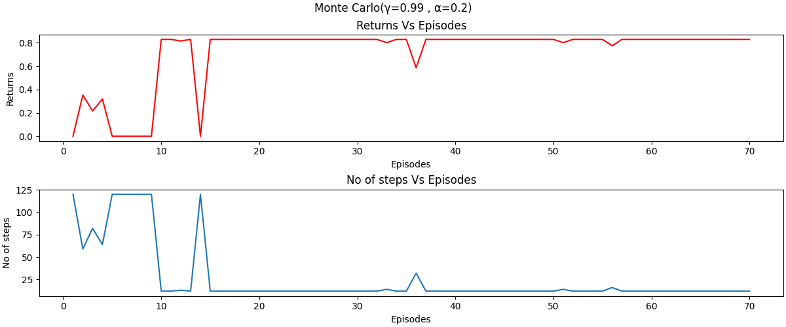
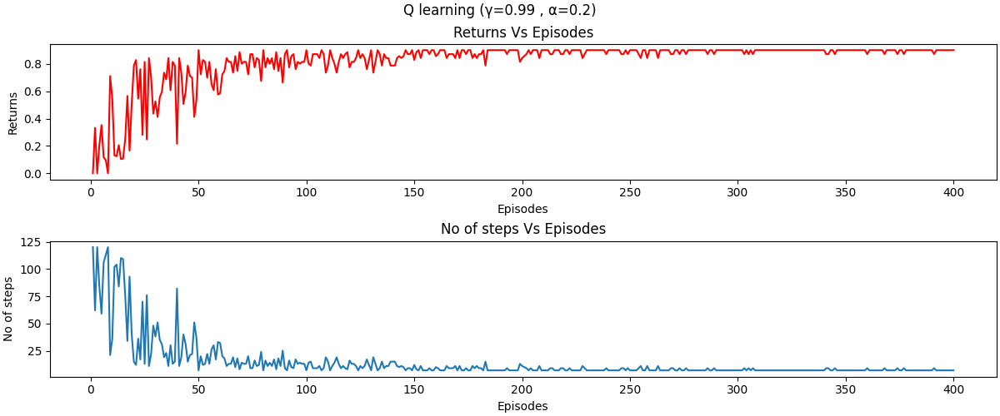

# Reinforcement Learning

## Description

This repository documents various tasks and insights gained through the study of Reinforcement Learning (RL). It includes detailed explanations of the environments used, graphical results from the implementation of different algorithms, and an overview of the challenges encountered during the process.

## Task 1: Solving Frozen Lake Environment using Dynamic Programming

### Documentation:  
[Frozen Lake Environment Documentation](https://www.gymlibrary.dev/environments/toy_text/frozen_lake/)

### Frozen Lake Environment Overview

#### Observation Space:  

Consider a 4x4 grid for discussion purpose:  

  

  
- **Observation space = Discrete(16)**  
- Each state is represented by a number ranging from 0 to 15.  
- A custom map can be defined, with each state labeled as S (Start), F (Frozen), H (Hole), or G (Goal).  
- In the default map, S is at 0 and G is at 15.  

**For a general n x n grid:**  
State representation = `current_row * nrows + current_col`  
(Where rows and columns start from zero)

#### Action Space:  
The agent can take one of four possible actions:  
<!--- **0:** Left  
- **1:** Down  
- **2:** Right  
- **3:** Up  -->
| Value | Action     |
|-------|----------- |
| 0     | Turn Left  |
| 1     | Turn Down  |
| 2     | Turn Right |
| 3     | Turn Up    |
#### Rewards:  
- **1 :**  On Reaching the goal  
- **0 :**  Otherwise  

---

## Task 2: Implementation of Model-Free Control Algorithms in the Minigrid Empty Space Environment

### Documentation:  
[Minigrid Empty Space Environment Documentation](https://minigrid.farama.org/environments/minigrid/EmptyEnv/)

### Minigrid Environment Overview

#### Observation Space:  

- **env.observation_space = { 'image': Box(0, 255, (7, 7, 3), uint8), 'direction': Discrete(4), 'mission': "Get to the green square" }**  

**Key Elements:**
- **Image:**  
  Represents the agent's view at any grid cell as a (7, 7, 3) matrix.  
  - The agent is visualized at the center of the 7x7 grid, can be termed as its "vision" (the set of grid cells it can perceive).  
  - The 3 channels in the matrix represent the RGB color intensities of each grid cell, ranging from 0 to 255.

- **Direction:**  
 Denotes the direction the agent is facing, with values in the range [0, 3]:
    
  | Value | Direction Faced |
  |-------|-----------|
  | 0     | Right     |
  | 1     | Down      |
  | 2     | Left      |
  | 3     | Up        |

- **Mission:**  
  A string that defines the agent's goal, typically "Get to the green square."

#### Action Space:  
Relevant actions for this environment:  

| Value | Action     |
|-------|----------- |
| 0     | Turn Left  |
| 1     | Turn Down  |
| 2     | Turn Right | 

When an action `a` is taken:  
`env.step(a)` returns a tuple:  
- `next_obs`: The observation space after taking action `a`.  
- `reward`: The immediate reward received after the action.  
- `done`: Boolean, `True` if the agent reaches the goal (termination condition).  
- `truncated`: Boolean, `True` if the episode terminates due to exceeding `max_steps`.  
- `info`: Additional information about the state.
#### Reward Function : 
- **Success:** A reward is calculated using the formula:  
  `Reward = 1 - 0.9 * (step_count / max_steps)`

- **Failure:** A reward of `0` is given.

---

## Minigrid Results:

### Monte Carlo:

### Sarsa:

### Sarsa(λ):

### Q-Learning:

